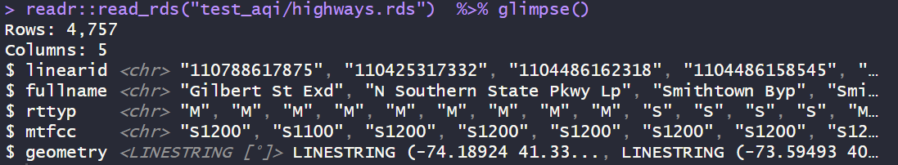

# README `/air_quality`

This folder contains hourly air quality records for a sample of sensors in the NYC metropolitan region, between January 2018 and June 2025. Some records have higher data quality than others. See below for descriptions, codebooks, and supporting metadata.

------------------------------------------------------------------------

## Prerequisites

Be sure to load these packages before trying to work with the data below. Some are written in `sf` spatial features format and will not preview correctly otherwise. Many are saved as compressed R Data Storage `.rds` files to conserve space and retain all column formats.

``` r
library(dplyr) # for data wrangling
library(readr) # for reading data
library(sf) # for spatial features
library(lubridate) # for date-time formatting
```

------------------------------------------------------------------------

## 🧠[**Codebook**](#codebook) {#codebook}

See below for a set of codebooks, one per relevant dataset. Codebooks were generated with AI; if any errors are spotted, please let the repository maintainer know.

-   🌫️ [air_quality.csv](#air-quality) — Air Quality Index scores and pollutant concentrations per hour, finalized, including Danni's NYC data
-   📡[sites.rds](#sitesrds) - Air Quality Sensor Locations
-   🏙️ [metro.rds](#metrords) — NYC Metro Counties
-   🗺️ [counties.rds](#countiesrds) — County Boundaries & Land Area
-   🛣️ [highways.rds](#highwaysrds) — Major Highways (TIGRIS)
-   🚦 [roads.rds](#roadsrds) — Local Roads (TIGRIS)
-   🗂 [bg.rds](#bgrds) — Census Block Groups (TIGRIS)

------------------------------------------------------------------------

### 🌫️`air_quality.csv`

This dataset contains hourly air quality measurements collected from various monitoring sites in the greater New York City census statistical area, including parts of NY and NJ. Each row represents a single observation at a specific time and location. Includes both AIRNOW API and NYC PM2.5 monitoring stations.


#### Variable Descriptions

| Variable | Type | Description |
|----|----|----|
| `aqs_id_full` | `double` | AQS (Air Quality System) site ID — a unique numeric identifier. For \~20 NYC sites not in AIRNOW system, follows format [\`8409999999XX\`]. |
| `datetime` | `POSIXct` | Timestamp of the observation (UTC time zone assumed unless otherwise noted). |
| `pollutant` | `character` | Air quality parameter being measured. For this dataset, always `"PM2.5"` (particulate matter ≤2.5 µm). |
| `value` | `double` | Measured value of the pollutant, in the units of the `unit` column. |
| `unit` | `character` | Unit of the value. `"UG/M3"` (micrograms per cubic meter) or "AQI", etc. |

#### Notes

-   Time granularity is **hourly**.
-   The AQI values are derived from the `concentration` using EPA standard conversion tables.
-   Refined version of `aqi.csv` that contains all air quality data. **USE THIS IN ANALYSES**.

------------------------------------------------------------------------

### 📡`sites.rds`

This dataset contains metadata and geospatial information about air quality monitoring sites used in the associated air quality measurements (`aqi.csv`). Each row represents a single monitoring location.


#### Variable Descriptions

| Variable | Type | Description |
|----|----|----|
| `aqs_id` | `character` | AQS (Air Quality System) site ID — unique identifier assigned by the EPA. |
| `aqs_id_full` | `double` | Full AQS site identifier, including U.S. country code prefix (`840`). |
| `site_name` | `character` | Short name or label for the monitoring site. |
| `site_agency` | `character` | Name of the agency responsible for operating the site. |
| `geometry` | `POINT [°]` | Spatial coordinates of the site in longitude and latitude (WGS84 projection), represented as a point geometry. |
| `dist` | `double` | Distance from nearest boundary of congestion relief zone (in kilometers). |

#### Notes

-   This dataset is typically used to map, filter, or label air quality sensor locations.
-   The `geometry` column may require geospatial packages (`sf` or `sp`) for proper interpretation.
-   `dist` is useful for nearest-neighbor queries or spatial subsetting.

------------------------------------------------------------------------

### 🏙️`metro.rds`

This dataset defines the set of counties that make up the New York City metropolitan area used in the air quality analysis.

#### Variable Descriptions

| Variable | Type | Description |
|----|----|----|
| `state` | `character` | U.S. state abbreviation (e.g., `"NY"`, `"NJ"`). |
| `county` | `character` | County name (e.g., `"Kings County"`). |
| `geoid` | `character` | FIPS-based geographic identifier (GEOID) for the county, used for joining with other datasets. |

#### Notes

-   The `geoid` is a 5-digit FIPS code commonly used in Census and EPA datasets.
-   This dataset can be used as a filter or spatial region definition for metropolitan-level aggregations.

------------------------------------------------------------------------

### 🗺️`counties.rds`

This dataset contains geospatial boundary data and metadata for counties in the analysis region (primarily NYC metro area and adjacent counties).


#### Variable Descriptions

| Variable | Type | Description |
|----|----|----|
| `state` | `character` | U.S. state abbreviation (e.g., `"NY"`, `"NJ"`). |
| `geoid` | `character` | FIPS-based geographic identifier (GEOID) for the county. |
| `name` | `character` | County name without "County" suffix. |
| `area_land` | `double` | Land area of the county in square meters. |
| `geometry` | `MULTIPOLYGON [°]` | Spatial polygon geometry of the county boundaries (WGS84 projection). |

#### Notes

-   This dataset is useful for mapping and spatial analysis.
-   The `geometry` column is compatible with geospatial packages such as `sf`.
-   `area_land` can be used to normalize emissions or population density calculations.

------------------------------------------------------------------------

### 🛣️`highways.rds`

This dataset includes TIGER/Line primary and secondary roads (major highways) within the NYC metropolitan area's bounding box.



#### Variable Descriptions

| Variable | Type | Description |
|----|----|----|
| `linearid` | `character` | Unique linear feature ID from the TIGER/Line shapefiles. |
| `fullname` | `character` | Full road or highway name (e.g., `"Southern State Pkwy"`). |
| `rttyp` | `character` | Road type classification (e.g., `"M"` for primary roads, `"S"` for secondary). |
| `mtfcc` | `character` | MAF/TIGER Feature Class Code (e.g., `"S1100"` for primary roads). |
| `geometry` | `LINESTRING [°]` | Spatial representation of the road segment. |

#### Notes

-   Data subset to fall within the bounding box from `bbox.rds`.
-   Focused on highways; excludes local streets.

------------------------------------------------------------------------

### 🚦`roads.rds`

This dataset includes all TIGER/Line road segments (including local streets) within the NYC metropolitan area counties.


#### Variable Descriptions

| Variable | Type | Description |
|----|----|----|
| `linearid` | `character` | Unique linear feature ID from the TIGER/Line shapefiles. |
| `fullname` | `character` | Full road or street name. |
| `rttyp` | `character` | Road type code (e.g., `"M"` for local road, `"S"` for secondary). |
| `mtfcc` | `character` | MAF/TIGER Feature Class Code (e.g., `"S1400"` for local neighborhood roads). |
| `geoid` | `character` | FIPS GEOID of the county containing the road segment. |
| `geometry` | `LINESTRING [°]` | Spatial geometry of the road segment (WGS84 projection). |

#### Notes

-   Larger and more detailed than `highways.rds`, includes residential and minor roads.
-   Can be joined to `counties.rds` via `geoid` for mapping and filtering.

------------------------------------------------------------------------

### 🗂 `bg.geojson`

This dataset contains **14,822 U.S. Census Block Groups** with spatial geometry and metadata, located in the broader NYC metro area. Each row represents a distinct block group identified by its `geoid`.

#### Variable Descriptions

| Column | Description |
|----|----|
| 🏛 `county` | 5-digit FIPS code for the county containing the block group |
| 🆔 `geoid` | 12-digit FIPS code uniquely identifying the block group |
| 🌎 `area_land` | Land area of the block group in square meters (numeric) |
| 🧭 `geometry` | Spatial geometry (multipolygon), used for mapping and spatial operations |

### 🧭 Spatial Info

-   CRS (Coordinate Reference System) should be inspected using `st_crs()` to confirm compatibility with other geospatial layers. Saved as NAD 83.
