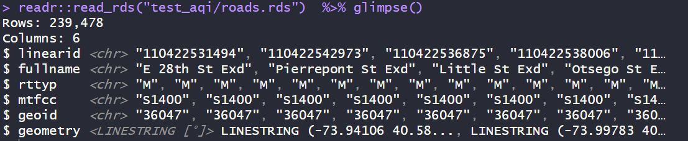

# README `/congestion_pricing`

This folder contains minute-by-minute data summarizing the impacts of congestion pricing and the congestion relief zone in New York City - the United States' biggest experiment with transportation activity management ever! Data below describes the congestion relief zone in Manhattan, with supporting metadata files.

[](images/clipboard-490080029.png)](https://congestionreliefzone.mta.info/)

------------------------------------------------------------------------

## Prerequisites

Be sure to load these packages before trying to work with the data below. Some are written in `sf` spatial features format and will not preview correctly otherwise. Many are saved as compressed R Data Storage `.rds` files to conserve space and retain all column formats.

``` r
library(dplyr) # for data wrangling
library(readr) # for reading data
library(sf) # for spatial features
library(lubridate) # for date-time formatting
```

------------------------------------------------------------------------

## 🧠[**Codebook**](#codebook) {#codebook}

-   🚗 [zone_vehicle_entries.rds](#zone_vehicle_entriesrds) — Vehicle Entries into Congestion Zone

-   🚧 [zone.rds](#zonerds) — Congestion Relief Zone Boundary

-   🛣️ [highways.rds](#highwaysrds) — Major Highways (TIGRIS)

-   🚦 [roads.rds](#roadsrds) — Local Roads (TIGRIS)

-   🗺️ [counties.rds](#countiesrds) — County Boundaries & Land Area

-   🏙️ [metro.rds](#metrords) — NYC Metro Counties

-   🗂 [bg.rds](#bgrds) — Census Block Groups (TIGRIS)

------------------------------------------------------------------------

### 🚗`zone_vehicle_entries.rds`

This dataset contains detailed traffic volume data for vehicles entering the NYC Congestion Relief Zone, grouped by vehicle class, location, and 10-minute time blocks since January 2025.


#### Variable Descriptions

| Variable | Type | Description |
|------------------------|------------------------|------------------------|
| `toll_date` | `date` | Calendar date of entry (YYYY-MM-DD). |
| `toll_hour` | `POSIXct` | Hourly timestamp of entry (floored to hour). |
| `toll_10min_block` | `POSIXct` | Timestamp for 10-minute time block (rounded). |
| `minute` | `double` | Minute of the hour (0–59). |
| `hour` | `double` | Hour of the day (0–23). |
| `day_int` | `double` | Integer code for day of the week (1 = Sunday, 7 = Saturday). |
| `day` | `character` | Day of the week as string (e.g., `"Monday"`). |
| `toll_week` | `date` | First date of the week (Sunday), for grouping by week. |
| `time_period` | `character` | Time-of-day category (e.g., `"AM Peak"`, `"Overnight"`). |
| `vehicle_class` | `character` | FHWA-style class description (e.g., `"1 - Cars, Pickups and Vans"`). |
| `detection_group` | `character` | Specific detection location (e.g., `"Brooklyn Bridge"`). |
| `detection_region` | `character` | Borough or area associated with the detection group (e.g., `"Brooklyn"`). |
| `crz_entries` | `double` | Count of vehicle entries into the Congestion Relief Zone in this time/location/class. |
| `excluded_roadway_entries` | `double` | Vehicle entries detected on excluded roadways (not tolled but measured). |

#### Notes

-   Dataset has 1,451,520 rows: includes all 10-minute intervals since the start of January 2025.
-   Primary variable of interest: `crz_entries`.
-   Can be used to summarize daily/hourly traffic volume by region, road, or vehicle class.
-   Data aligned to official congestion pricing boundaries defined in `zone.rds`.

------------------------------------------------------------------------

### 🚧`zone.rds`

This dataset defines the polygon boundary for the NYC Congestion Relief Zone.


#### Variable Descriptions

| Variable | Type | Description |
|------------------------|------------------------|------------------------|
| `geometry` | `MULTIPOLYGON [°]` | The official boundary of the congestion relief or tolling zone within NYC, represented as one or more polygons in WGS84 coordinates. |

#### Notes

-   Can be used to mask or extract road or sensor features within the congestion pricing area.
-   Useful for spatial comparisons (inside vs outside zone).

------------------------------------------------------------------------

### 🛣️`highways.rds`

This dataset includes TIGER/Line primary and secondary roads (major highways) within the NYC metropolitan area's bounding box.


#### Variable Descriptions

| Variable | Type | Description |
|------------------------|------------------------|------------------------|
| `linearid` | `character` | Unique linear feature ID from the TIGER/Line shapefiles. |
| `fullname` | `character` | Full road or highway name (e.g., `"Southern State Pkwy"`). |
| `rttyp` | `character` | Road type classification (e.g., `"M"` for primary roads, `"S"` for secondary). |
| `mtfcc` | `character` | MAF/TIGER Feature Class Code (e.g., `"S1100"` for primary roads). |
| `geometry` | `LINESTRING [°]` | Spatial representation of the road segment. |

#### Notes

-   Data subset to fall within the bounding box from `bbox.rds`.
-   Focused on highways; excludes local streets.

------------------------------------------------------------------------

### 🚦`roads.rds`

This dataset includes all TIGER/Line road segments (including local streets) within the NYC metropolitan area counties.



#### Variable Descriptions

| Variable | Type | Description |
|------------------------|------------------------|------------------------|
| `linearid` | `character` | Unique linear feature ID from the TIGER/Line shapefiles. |
| `fullname` | `character` | Full road or street name. |
| `rttyp` | `character` | Road type code (e.g., `"M"` for local road, `"S"` for secondary). |
| `mtfcc` | `character` | MAF/TIGER Feature Class Code (e.g., `"S1400"` for local neighborhood roads). |
| `geoid` | `character` | FIPS GEOID of the county containing the road segment. |
| `geometry` | `LINESTRING [°]` | Spatial geometry of the road segment (WGS84 projection). |

#### Notes

-   Larger and more detailed than `highways.rds`, includes residential and minor roads.
-   Can be joined to `counties.rds` via `geoid` for mapping and filtering.

------------------------------------------------------------------------

### 🗺️`counties.rds`

This dataset contains geospatial boundary data and metadata for counties in the analysis region (primarily NYC metro area and adjacent counties).


#### Variable Descriptions

| Variable | Type | Description |
|------------------------|------------------------|------------------------|
| `state` | `character` | U.S. state abbreviation (e.g., `"NY"`, `"NJ"`). |
| `geoid` | `character` | FIPS-based geographic identifier (GEOID) for the county. |
| `name` | `character` | County name without "County" suffix. |
| `area_land` | `double` | Land area of the county in square meters. |
| `geometry` | `MULTIPOLYGON [°]` | Spatial polygon geometry of the county boundaries (WGS84 projection). |

#### Notes

-   This dataset is useful for mapping and spatial analysis.
-   The `geometry` column is compatible with geospatial packages such as `sf`.
-   `area_land` can be used to normalize emissions or population density calculations.

------------------------------------------------------------------------

### 🏙️`metro.rds`

This dataset defines the set of counties that make up the New York City metropolitan area used in the air quality analysis.

#### Variable Descriptions

| Variable | Type | Description |
|------------------------|------------------------|------------------------|
| `state` | `character` | U.S. state abbreviation (e.g., `"NY"`, `"NJ"`). |
| `county` | `character` | County name (e.g., `"Kings County"`). |
| `geoid` | `character` | FIPS-based geographic identifier (GEOID) for the county, used for joining with other datasets. |

#### Notes

-   The `geoid` is a 5-digit FIPS code commonly used in Census and EPA datasets.
-   This dataset can be used as a filter or spatial region definition for metropolitan-level aggregations.

------------------------------------------------------------------------

### 🗂 `bg.geojson`

This dataset contains **14,822 U.S. Census Block Groups** with spatial geometry and metadata, located in the broader NYC metro area. Each row represents a distinct block group identified by its `geoid`.

#### Variable Descriptions

| Column | Description |
|------------------------------------|------------------------------------|
| 🏛 `county` | 5-digit FIPS code for the county containing the block group |
| 🆔 `geoid` | 12-digit FIPS code uniquely identifying the block group |
| 🌎 `area_land` | Land area of the block group in square meters (numeric) |
| 🧭 `geometry` | Spatial geometry (multipolygon), used for mapping and spatial operations |

### 🧭 Spatial Info

-   CRS (Coordinate Reference System) should be inspected using `st_crs()` to confirm compatibility with other geospatial layers. Saved as NAD 83.
