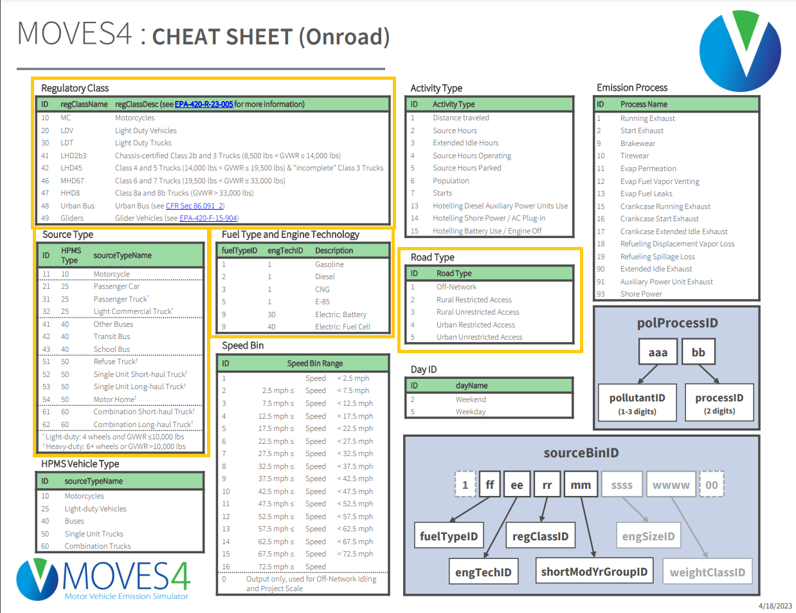
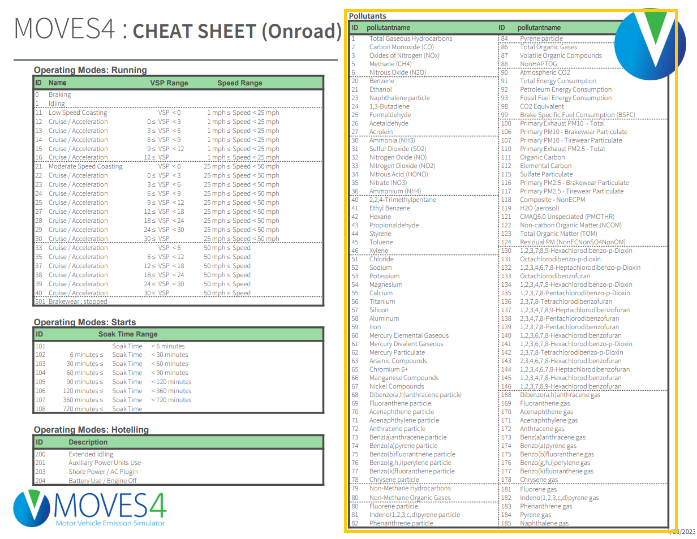
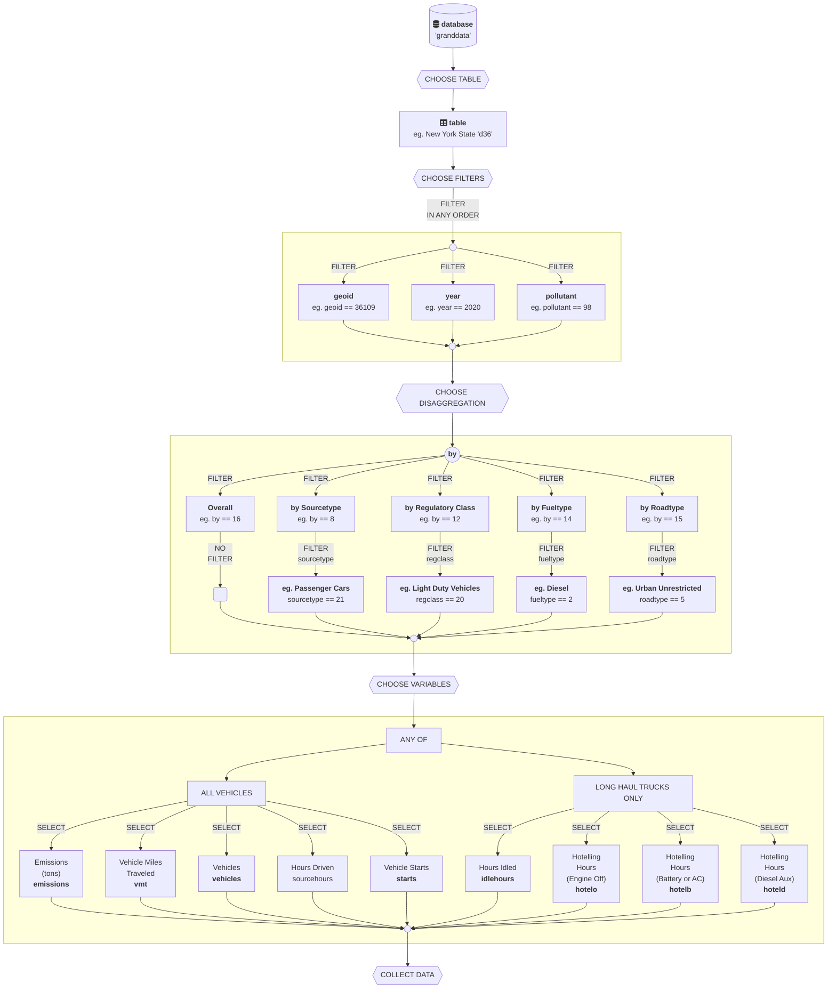

# README `/transportation`

Explainer for the `emissions.rds` database file and accompanying files in the `transportation` folder.
Sourced from Cornell's `catserver`, a county level database of emissions estimates for every county in the US, from 1990-2060.

## Dataset Codebooks

### `emissions.rds` - Emissions and vehicle activity per county-year per pollutant, vehicle sourcetype, regulatory class, fueltype, and roadtype.

| Variable      | Type      | Description                                           | Example                       |
| ------------- | --------- | ----------------------------------------------------- | ----------------------------- |
| `by`          | integer   | Disaggregation level ID (see section 3.3 for details) | 16 (overall), 8 (sourcetype)  |
| `year`        | integer   | Year of the record                                    | 2020                          |
| `geoid`       | character | Geographic identifier (county/state)                  | "36109" (Tompkins County, NY) |
| `pollutant`   | integer   | Pollutant code (see section 4 for list)               | 98 (CO2 Equivalent)           |
| `sourcetype`  | integer   | Vehicle source type (NA if `by == 16`)                | 21 (Passenger Car)            |
| `regclass`    | integer   | Regulatory vehicle class (NA if not applicable)       | 20 (Light Duty Vehicle)       |
| `fueltype`    | integer   | Fuel type (NA if not applicable)                      | 2 (Diesel)                    |
| `roadtype`    | integer   | Road type (NA if not applicable)                      | 5 (Urban Unrestricted)        |
| `emissions`   | double    | Annual emissions for the pollutant (US tons)          | 50000.12                      |
| `vmt`         | double    | Vehicle Miles Traveled (annual miles)                 | 10000000                      |
| `vehicles`    | double    | Total vehicles counted                                | 50000                         |
| `starts`      | double    | Number of vehicle starts (ignitions)                  | 1200000                       |
| `sourcehours` | double    | Hours vehicles were operating                         | 2000000                       |
| `idlehours`   | double    | Hours trucks spent idling (NA if not applicable)      | NA                            |
| `hoteld`      | double    | Hours trucks spent hotelling with diesel aux power    | NA                            |
| `hotelb`      | double    | Hours trucks spent hotelling with battery or AC       | NA                            |
| `hotelo`      | double    | Hours trucks spent hotelling with all engines off     | NA                            |

### Example Output from `emissions.rds`

Below is an example snippet of typical rows from the emissions dataset for Tompkins County, NY (`geoid == "36109"`), year 2020, pollutant CO2 Equivalent (`pollutant == 98`):

| by | year | geoid | pollutant | sourcetype | regclass | fueltype | roadtype | emissions |     vmt | sourcehours | vehicles |  starts | idlehours | hoteld | hotelb | hotelo |
| :- | :--- | :---- | :-------- | :--------- | :------- | :------- | :------- | --------: | ------: | ----------: | -------: | ------: | --------: | -----: | -----: | -----: |
| 16 | 2020 | 36109 | 98        | NA         | NA       | NA       | NA       |  50000.23 | 1.2e+07 |      400000 |    15000 | 1200000 |        NA |     NA |     NA |     NA |
| 8  | 2020 | 36109 | 98        | 21         | NA       | NA       | NA       |  30000.11 | 7.5e+06 |      250000 |     8000 |  650000 |        NA |     NA |     NA |     NA |
| 14 | 2020 | 36109 | 98        | NA         | NA       | 2        | NA       |  10000.45 | 2.5e+06 |       90000 |     3000 |  250000 |        NA |     NA |     NA |     NA |
| 15 | 2020 | 36109 | 98        | NA         | NA       | NA       | 5        |   2000.67 | 5.0e+05 |       20000 |     3000 |  100000 |        NA |     NA |     NA |     NA |

*Note: NA values indicate that those fields are not applicable for that level of disaggregation.*

---

### `areas.rds` - Areas

| field            | type      | meaning                               | example                       |
| :--------------- | :-------- | :------------------------------------ | :---------------------------- |
| `type`           | character | Type of area (currently mostly NA)    | NA                            |
| `geoid`          | character | Unique geographic identifier          | `"36001"` (Albany County, NY) |
| `level`          | character | Geographic level                      | `"county"`                    |
| `state`          | character | State abbreviation                    | `"NY"`                        |
| `state_code`     | character | Numeric state code                    | `"36"`                        |
| `name`           | character | Short name of the area                | `"Albany"`                    |
| `fullname`       | character | Full name of the area including state | `"Albany County, NY"`         |
| `division`       | character | Census division name                  | `"Middle Atlantic"`           |
| `level_plural`   | character | Plural form of level                  | `"counties"`                  |
| `level_singular` | character | Singular form of level                | `"county"`                    |
| `level_upper`    | character | Upper level abbreviation              | `"NY"`                        |
| `area`           | character | General area type                     | `"County"`                    |
| `sublevel`       | character | Sub-level identifier                  | `"muni"`                      |
| `geoid_upper`    | character | Upper geographic identifier           | `"36"`                        |

---

### `bys.rds` - Disaggregation Types

| field   | type      | meaning                             | example     |
| :------ | :-------- | :---------------------------------- | :---------- |
| `by`    | double    | Numeric ID for disaggregation level | `16`        |
| `term`  | character | Name of the disaggregation level    | `"overall"` |
| `label` | character | Human-readable label                | `"Overall"` |

---

### `pollutants.rds` - Pollutants

| field       | type      | meaning                   | example            |
| :---------- | :-------- | :------------------------ | :----------------- |
| `pollutant` | double    | Pollutant ID              | `98`               |
| `term`      | character | Full name of pollutant    | `"CO2 Equivalent"` |
| `label`     | character | Short label for pollutant | `"CO2e"`           |

---

### `metrics.rds` - Metric Names and Labels

| field   | type      | meaning                     | example              |
| :------ | :-------- | :-------------------------- | :------------------- |
| `term`  | character | Metric identifier           | `"emissions"`        |
| `label` | character | Human-readable metric label | `"Emissions (tons)"` |

---

### `roads.rds` - Roads spatial data

| field      | type      | meaning                               | example              |
| :--------- | :-------- | :------------------------------------ | :------------------- |
| `linearid` | character | Unique identifier for road segment    | `"1104487584583"`    |
| `fullname` | character | Full name of the road                 | `"State Rte 85 Alt"` |
| `rttyp`    | character | Road type code                        | `"S"`                |
| `mtfcc`    | character | MAF/TIGER feature classification      | `"S1200"`            |
| `geoid`    | character | Geographic ID of area containing road | `"36001"`            |
| `geometry` | geometry  | Spatial geometry of road segment      | `LINESTRING (...)`   |

---

### `counties.geojson` / `states.geojson` - geographic boundaries

| field        | type      | meaning                           | example              |
| :----------- | :-------- | :-------------------------------- | :------------------- |
| `geoid`      | character | Geographic ID                     | `"01061"`            |
| `state`      | character | State abbreviation                | `"AL"`               |
| `name`       | character | County or state name              | `"Geneva County"`    |
| `area_land`  | double    | Land area (square meters)         | `1487908432`         |
| `area_water` | double    | Water area (square meters)        | `11567409`           |
| `geometry`   | geometry  | Spatial polygons or multipolygons | `MULTIPOLYGON (...)` |

 
 

---

## Understanding `emissions.rds` and data from Cornell's CATSERVER

This data was generated by the EPA's MOVES software, the gold standard for emissions estimation. Then, it was post-processed into a tidy format by the CAT team. Most codes in the database are derived from the [**MOVES id codes, available here.**](https://github.com/USEPA/EPA_MOVES_Model/blob/master/docs/MOVES4CheatsheetOnroad.pdf) Here's a brief description of the tables, columns, and their values.

### identifiers

Every row has 3 main identifier fields, including `geoid`, `year`, `pollutant`, and `by`. See table below for definitions.

| field        |  type    |  meaning  | example                             |
|:---          |  :---:   | :---    |:---                                    |
| `geoid` | character | unique string identifier for each geographic area. | The US overall is `00` (2 characters). New York state is `36` (2 characters). Tompkins County, NY is `36109` (5 characters). |
| `year` | integer | unique 4-digit identifier for each year. | Currently, every 5 years from 1990 to 2060 are implemented (I think we skipped 1995 because MOVES couldn't do it (?)). |
| `pollutant` | integer | unique 2-3 digit identifier for each of ~19 supported pollutants. | `pollutant == 98` is CO2e, or Carbon Dioxide Equivalent, our main pollutant of interest. (Note: Steer clear of VOC; I think it's only partially accurate. Ask Tim for more details.) For the complete list of `ids` outputted by MOVES, see the [**MOVES Onroad Cheatsheet**](moves_cheatsheet_onroad.pdf). |
| `by` | integer | unique identifier for each level of disaggregation, specific to our CAT system. | This id includes [16, 8, 12, 14, and 15], and describes whether that row reflects a value overall (`by == 16`) or a value disaggregeated by a specific `sourcetype` (`by == 8`), a specific `fueltype` (`by == 14`), a specific `regclass`/regulatory class (`by == 12`), or a specific `roadtype` (`by == 15`). When `by == 16` (overall), the `sourcetype`, `regclass`, `fueltype`, and `roadtype` fields will all be `NA` (because it's overall, not disaggregated). |

### disaggregation identifier

Every row has the special `by` identifier, which as mentioned above, shows the level of disaggregation in CAT formatted data. Here's a breakdown of currently supported `by` disaggregation levels.

| `by` value |  disaggregation    |  meaning                   | example                                                                 |
|:------------          |  :---:   | :---                       |   :---                                                                  |
| `16` | overall | emissions, vmt, etc. *overall*. | A row where `by == 16` shows the total onroad emissions, vmt, sourcehours, etc. for geographic area (`geoid`) in that `year`, overall. |
| `8` | by sourcetype | emissions, vmt, vehicles, etc. by type of vehicle. | Total CO2e emissions for passenger cars in Tompkins county in 2020 would be in the row where `by == 8`, `sourcetype == 21`, `year == 2020`,  `geoid == "36109"`, and `pollutant == 98`. |
| `12` | by regclass |  emissions, vmt, vehicles, etc. by regulatory class of vehicle. | So total CO2e emissions for light duty vehicles in Tompkins County in 2020 would be in the row where `by == 12`, `regclass == 20`, `year == 2020`, `geoid == "36109"`, and `pollutant == 98`. |
| `14` | by fueltype | emissions, vmt, vehicles etc. by type of fuel. | So total CO2e emissions from diesel vehicles in Tompkins County in 2020 would be in the row where `by == 14`, `fueltype == 2`, `year == 2020`,  `geoid == "36109"`, and `pollutant == 98`. |
| `15` | by roadtype | emissions and vmt by type of road. | (Notice that non-road dependent values like `vehicles` does NOT vary by road but remains constant across all roadtypes.) So, total CO2e emissions from urban unrestricted roads in Tompkins County in 2020 would be in the row where `by == 15`, `roadtype == 5`, `year == 2020`, `geoid == 36109`, and `pollutant == 98`. |

### subtype identifiers

Each row has 4 subtype identifiers, describing whether the `emissions` and other metrics reported are measured ***overall*** for that `geoid-year-pollutant` set or measured for a specific `sourcetype`, `regclass`, `fueltype`, and/or `roadtype`. Each specific subtype has a unique ID code, originating from MOVES. If all 4 dissagregation identifiers are `NA`, it means it's measured overall and *not* disaggregated. For the complete list of `ids` outputted by MOVES, see the [**MOVES Onroad Cheatsheet**](moves_cheatsheet_onroad.pdf), also shown below the table.

| field        |  type    |  meaning                   | example                                                                 |
|:---          |  :---:   | :---                       |   :---                                                                  |
| `sourcetype` | integer  | unique vehicle type id     |  passenger cars is `sourcetype == 21`.                                  |
| `regclass`   | integer  | unique regulatory class id | light duty vehicles is `regclass == 20`.                                |
| `fueltype`  | integer   | unique fuel type id        | diesel is `fueltype == 2`                                               |
| `roadtype`  | integer   | unique road type id        | urban unrestricted access roads (eg. trucks allowed) is `roadtype == 5` |

### metrics

Finally, each unique set of identifiers above contains its own metrics! Every row contains 9 metrics of interest. These include `emissions`, plus 8 activity metrics. (Although not all counties have all; MOVES can't estimate idling or hotelling for counties without much long-haul truck activity). 

| field        |  type    |  units  | meaning                             |
|:---          |  :---:   | :---    |:---                                    |
| `emissions` | double   | US tons | total annual onroad *emissions*, for whatever pollutant is selected  |
| `vmt`       | double   | miles | total annual onroad *vehicle miles traveled* |
| `vehicles` | double | vehicles | total annual *vehicles* onroad in that county |
| `starts` | double | times | total annual times vehicles were started (ignitions) |
| `sourcehours` | double | hours | total annual hours vehicles were in operation onroad |
| `idlehours`  | double | hours | total annual hours trucks spent idling. Only applies to a few categories of large combo trucks (I believe). Locations without these trucks will have a value of `NA`. |
| `hoteld` | double | hours | total annual hours trucks spent 'hotelling', doing [mandatory rest breaks](https://www.epa.gov/sites/default/files/2017-01/documents/hoteling-hrs-moves.pdf), using *Diesel Auxiliary Power*. |
| `hotelb` | double | hours | total annual hours trucks spent 'hotelling' doing [mandatory rest breaks](https://www.epa.gov/sites/default/files/2017-01/documents/hoteling-hrs-moves.pdf),  using *Battery or AC*. |
| `hotelo` | double | hours | total annual hours trucks spent 'hotelling', doing [mandatory rest breaks](https://www.epa.gov/sites/default/files/2017-01/documents/hoteling-hrs-moves.pdf), when *All Engines Off*. |

### Diagram

When filtering a table, it may help to use the following order shown in the `mermaid` diagram below.

## Index of Unique Variables

CAT Format currently includes the following set of fields, the unique ids within them, the term they represent, and a descriptive label for each.

| field | id | term | label | 
|:---  | :---: | :--- | :--- |
| by | 16 | "overall" | Overall |
| by | 8 | "sourcetype" | Source |
| by | 12 | "regclass" | Regulatory Class |
| by | 14 | "fueltype" | Fuel |
| by | 15 | "roadtype" | Road |
| pollutant |  98 |  "CO2 Equivalent" |  "CO2e" | 
| pollutant | 91 |  "Total Energy Consumption" |  "Energy Consumption" | 
| pollutant | 1 |  "Total Gaseous Hydrocarbons (TGH)" |  "TGH" | 
| pollutant | 5 |  "Methane (CH4)" |  "CH4" | 
| pollutant | 90 |  "Atmospheric CO2" |  "Atmospheric CO2" | 
| pollutant | 31 |  "Sulfur Dioxides (SO2)" |  "SO2" | 
| pollutant | 3 |  "Oxides of Nitrogen (NOx)" |  "NOx" | 
| pollutant | 6 |  "Nitrous Oxide (N20)" |  "N20" | 
| pollutant | 2 |  "Carbon Monoxide (CO)" |  "CO" | 
| pollutant | 87 |  "Volatile Organic Compounds" |  "VOC" | 
| pollutant | 79 |  "Non-Methane Hydrocarbons" |  "NMH" | 
| pollutant | 110 |  "Primary Exhaust PM2.5 - Total" |  "PM2.5" | 
| pollutant | 117 |  "Primary PM2.5 - Tirewear Particulate" |  "PM2.5 - Tirewear" | 
| pollutant | 116 |  "Primary PM2.5 - Brakeware Particulate" |  "PM2.5 - Brakewear" | 
| pollutant | 112 |  "Elemental Carbon" |  "Elemental Carbon" | 
| pollutant | 115 |  "Sulfate Particulate" |  "Suflate Particulate" | 
| pollutant | 118 |  "Composite - NonECPM" |  "Composite - NonECPM" | 
| pollutant | 119 |  "H20 (aerosol)" |  "H20" | 
| pollutant | 100 |  "Primary Exhaust PM10 - Total" |  "PM10" | 
| pollutant | 106 |  "Primary PM10 - Breakware Particulate" |  "PM10 - Breakware" | 
| pollutant | 107 |  "Primary PM10 - Tirewear Particulate" | "PM10 - Tirewear" |
| sourcetype | 11 | "Motorcycle" | "Car/\nBike" |
| sourcetype | 21 |  "Passenger Car" |  "Car/\nBike" | 
| sourcetype | 31 |  "Passenger Truck" |  "Light\nTruck" | 
| sourcetype | 32 |  "Light Commercial Truck" |  "Light\nTruck" | 
| sourcetype | 41 |  "Other Buses" |  "Bus" | 
| sourcetype | 42 |  "Transit Bus" |  "Bus" | 
| sourcetype | 43 |  "School Bus" |  "Bus" | 
| sourcetype | 51 |  "Refuse Truck" |   "Heavy\nTruck" | 
| sourcetype | 52 |  "Single Unit Short-haul Truck" |   "Heavy\nTruck" | 
| sourcetype | 53 |  "Single Unit Long-haul Truck" |   "Heavy\nTruck" | 
| sourcetype | 54 |  "Motor Home" |   "Heavy\nTruck" | 
| sourcetype | 61 |  "Combination Short-haul Truck" |  "Combo\nTruck" | 
| sourcetype | 62 |  "Combination Long-haul Truck" |  "Combo\nTruck") |
 | regclass | 10 | "MC" | "MC" |
| regclass | 20 | "LDV" |"LDV" |
| regclass | 30 | "LDT" | "LDT" | 
| regclass | 40 | "LHD2b3" | "LHD2b3" |
| regclass |  41 | "LHD34" | "LHD34" |
| regclass |  42 | "LHD45" |"LHD45" |
| regclass |  46 | "MHD67" |"MHD67" |
 | regclass | 47 | "HHD8" |"HHD8" |
 | regclass | 48 | "Urban Bus" |"Urban Bus" |
| regclass |  49 | "Glider" | "Glider" |
| fueltype | 1| "Gasoline" |  "Gas" | 
| fueltype | 2 |  "Diesel Fuel" |  "Diesel" | 
| fueltype | 3 |  "Compressed Natural Gas (CNG)" |  "CNG" | 
| fueltype | 4 |  "Liquefied Petroleum Gas (LNG)" |  "LNG" | 
| fueltype | 5 |  "Ethanol (E-85)" |  "Ethanol" | 
| fueltype | 9 |  "Electricity" |  "Electricity" | 
| roadtype | 5 | Urban Unrestricted Access | Urban\nUnrestricted |
| roadtype | 4 | Urban Restricted Access | Urban\nRestricted |
| roadtype | 3 | Rural Unrestricted Access | Rural\nUnrestricted |
| roadtype | 2 | Rural Restricted Access | Rural\nRestricted |
| roadtype | 1 | Off-Network | Off-Network |
