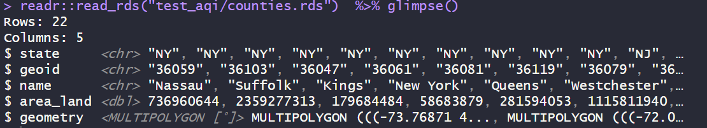
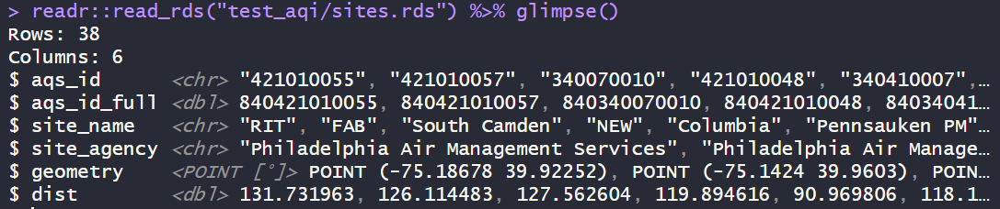

# README `/weather`

This folder contains hourly meteorological data for the **New York City metro region,** stored in `weather.csv`, with supporting metadata files.

------------------------------------------------------------------------

## Prerequisites

Be sure to load these packages before trying to work with the data below. Some are written in `sf` spatial features format and will not preview correctly otherwise. Many are saved as compressed R Data Storage `.rds` files to conserve space and retain all column formats.

``` r
library(dplyr) # for data wrangling
library(readr) # for reading data
library(sf) # for spatial features
library(lubridate) # for date-time formatting
```

------------------------------------------------------------------------

## 🧠[**Codebook**](#codebook) {#codebook}

-   🌦️ [weather.csv](#weathercsv) — Hourly Weather per Sensor (Visual Crossing)

-   📡[sites.rds](#sitesrds) - Air Quality Sensor Locations

-   🏙️ [metro.rds](#metrords) — NYC Metro Counties

-   🗺️ [counties.rds](#countiesrds) — County Boundaries & Land Area

-   🗂 [bg.rds](#bgrds) — Census Block Groups (TIGRIS)

------------------------------------------------------------------------

### 🌦️`weather.csv`

This dataset provides **hourly weather observations** at the locations of specific air quality sensors throughout New York City, using data from the Visual Crossing API (U.S. metric units). It includes meteorological conditions relevant to air quality and transportation exposure modeling.


------------------------------------------------------------------------

#### Variable Descriptions

| Variable | Type | Description |
|------------------------|------------------------|------------------------|
| `aqs_id_full` | `dbl` | Full AQS sensor site ID, uniquely identifying the monitoring location. |
| `datetime` | `POSIXct` | UTC timestamp of the weather observation (hourly resolution). |
| `temp` | `dbl` | Air temperature (°F) at the time of observation. |
| `dew` | `dbl` | Dew point temperature (°F). |
| `humidity` | `dbl` | Relative humidity (%). |
| `precip` | `dbl` | Precipitation during the hour (inches), including liquid-equivalent frozen precipitation. |
| `windspeed` | `dbl` | Sustained wind speed (mph), averaged over the preceding 1–2 minutes. |
| `winddir` | `dbl` | Wind direction (degrees), indicating the direction **from** which the wind is blowing. |
| `cloudcover` | `dbl` | Cloud cover (%), representing sky obscuration at the hour of observation. |
| `solarradiation` | `dbl` | Solar radiation (W/m²), instantaneous value. |
| `uvindex` | `dbl` | UV exposure index (0–10), calculated based on solar radiation, cloudiness, time of day/year, and elevation. |

#### Notes

-   All times are in **UTC**. Local conversions may be required depending on application.
-   Data is retrieved from the Visual Crossing API using U.S. metric units.
-   The UV index indicates potential exposure risk, where 0 = none, 10 = extreme.
-   Cloud cover and solar radiation are critical variables for photochemical pollutant formation.
-   Useful for hourly exposure modeling, emissions sensitivity studies, and weather-adjusted forecasting.

------------------------------------------------------------------------

### 🏙️`metro.rds`

This dataset defines the set of counties that make up the New York City metropolitan area used in the air quality analysis.

#### Variable Descriptions

| Variable | Type | Description |
|------------------------|------------------------|------------------------|
| `state` | `character` | U.S. state abbreviation (e.g., `"NY"`, `"NJ"`). |
| `county` | `character` | County name (e.g., `"Kings County"`). |
| `geoid` | `character` | FIPS-based geographic identifier (GEOID) for the county, used for joining with other datasets. |

#### Notes

-   The `geoid` is a 5-digit FIPS code commonly used in Census and EPA datasets.
-   This dataset can be used as a filter or spatial region definition for metropolitan-level aggregations.

------------------------------------------------------------------------

### 🗺️`counties.rds`

This dataset contains geospatial boundary data and metadata for counties in the analysis region (primarily NYC metro area and adjacent counties).



#### Variable Descriptions

| Variable | Type | Description |
|------------------------|------------------------|------------------------|
| `state` | `character` | U.S. state abbreviation (e.g., `"NY"`, `"NJ"`). |
| `geoid` | `character` | FIPS-based geographic identifier (GEOID) for the county. |
| `name` | `character` | County name without "County" suffix. |
| `area_land` | `double` | Land area of the county in square meters. |
| `geometry` | `MULTIPOLYGON [°]` | Spatial polygon geometry of the county boundaries (WGS84 projection). |

#### Notes

-   This dataset is useful for mapping and spatial analysis.
-   The `geometry` column is compatible with geospatial packages such as `sf`.
-   `area_land` can be used to normalize emissions or population density calculations.

------------------------------------------------------------------------

### 📡`sites.rds`

This dataset contains metadata and geospatial information about air quality monitoring sites used in the associated weather data (`weather.csv`). Each row represents a single monitoring location.



#### Variable Descriptions

| Variable | Type | Description |
|------------------------|------------------------|------------------------|
| `aqs_id` | `character` | AQS (Air Quality System) site ID — unique identifier assigned by the EPA. |
| `aqs_id_full` | `double` | Full AQS site identifier, including U.S. country code prefix (`840`). |
| `site_name` | `character` | Short name or label for the monitoring site. |
| `site_agency` | `character` | Name of the agency responsible for operating the site. |
| `geometry` | `POINT [°]` | Spatial coordinates of the site in longitude and latitude (WGS84 projection), represented as a point geometry. |
| `dist` | `double` | Distance from nearest boundary of congestion relief zone (in kilometers). |

#### Notes

-   This dataset is typically used to map, filter, or label air quality sensor locations.
-   The `geometry` column may require geospatial packages (`sf` or `sp`) for proper interpretation.
-   `dist` is useful for nearest-neighbor queries or spatial subsetting.

------------------------------------------------------------------------

### 🗂 `bg.geojson`

This dataset contains **14,822 U.S. Census Block Groups** with spatial geometry and metadata, located in the broader NYC metro area. Each row represents a distinct block group identified by its `geoid`.

#### Variable Descriptions

| Column | Description |
|------------------------------------|------------------------------------|
| 🏛 `county` | 5-digit FIPS code for the county containing the block group |
| 🆔 `geoid` | 12-digit FIPS code uniquely identifying the block group |
| 🌎 `area_land` | Land area of the block group in square meters (numeric) |
| 🧭 `geometry` | Spatial geometry (multipolygon), used for mapping and spatial operations |

### 🧭 Spatial Info

-   CRS (Coordinate Reference System) should be inspected using `st_crs()` to confirm compatibility with other geospatial layers. Saved as NAD 83.
